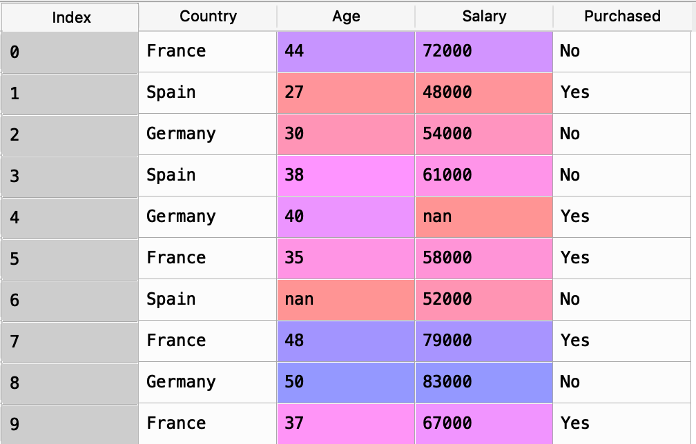

# Data PreProcessing:
No matter how boring this step might look like at the first glance, it is the crutial step to take in order to start our amazing journey of machin learning. Doing this part, garantees bigger pleasure later on during our fun projects.
So lets get on with it!

## Required Libraries
- Numpy 
- Matplotlib(pyplot sub-library)
- Pandas
- Scikit-Learn

To import the libraries we can easily use the following code snippet

```python
import numpy as np
import pandas as pd
import matplotlib.pyplot as plt
```

## Importing DataSet
we can use the pandas library for importing the dataset. Depending on the type of input file, we can call pandas appropriate method.
For this example the input data set is a csv file and we use the "read_csv" method.
```python
dataset = pd.read_csv("./Data.csv")
```

## Looking at the dataSet:
Pandas creates a dataframe for us (a framework similar to the tables in the excelsheet). Each row of this dataframe represents a datapoint in our dataset, while each colomn represents a feature for different datapoints.
The first step in processing any data is to look into our data set and get a sence of it. 

The following shows the initial data frame created by pandas for this example:


### Initial CheckList and actions:

1. Defrentiating independent variables and dependent variable:
..Creating new variables, Lets call them X and y, where X = Matrix of **independent Variables(featurs)** and y=array of **Dependent Variable(target)**.. As a genral practice, uppercase characte is used for the matrix of independent variables while the lower case is used for the target variable

```python
X = dataset.iloc[:,0:3]
y = dataset.iloc[:,3:4]
```
2. Handling Missing Data:


